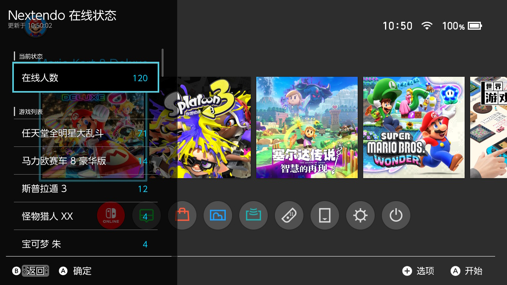
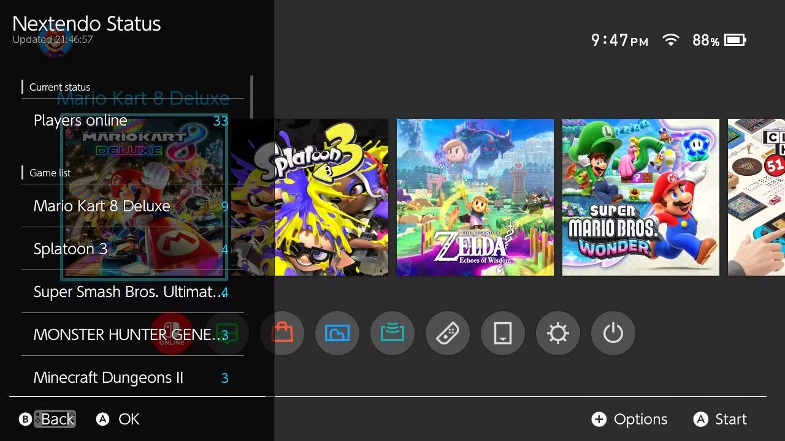

<h1 align="center">Nextendo 在线状态</h1>

<p align="center">
  <b>在 Switch 上直接查看 Nextendo Network 的在线人数</b><br>
  <a href="#english">English</a>
</p>

---

## 这是什么

一个 Switch 上的悬浮面板（overlay）。玩着游戏的时候按个快捷键，就能看到 Nextendo Network 现在有多少人在线、都在玩什么，不用退出游戏、不用拿起手机。

数据来自 [Nextendo Network 状态页](https://nextendo.network/status.html) 使用的同一个接口。

## 功能

- **总在线人数** —— 和官网状态页显示的数字一致
- **游戏列表** —— 按人数从多到少排列，一眼看出哪个游戏最热闹
- **中文游戏名** —— 英文原名过长的游戏会显示中文名
- **自动刷新** —— 面板打开时每 15 秒更新一次
- **手动刷新** —— 选中「在线人数」按 **A** 立即刷新
- **打开即显示** —— 记住上次的人数，下次打开立刻就有，不用等网络
- **中英双语界面** —— 跟随主机系统语言自动切换

## 界面

<p align="center">
  
</p>


## 按键

| 按键 | 作用 |
|------|------|
| **A** | 在「在线人数」上按下 → 立即刷新 |
| **B** | 关闭面板 |
| **摇杆** | 上下滚动列表 |

## 安装

**前置条件**：已经装好 Tesla 格式的 overlay 加载器，通常是 [nx-ovlloader](https://github.com/ppkantorski/nx-ovlloader)（Ultrahand Overlay 的一部分）。

1. 从 [Releases](../../releases/latest) 下载 `nextendo-status.ovl`
2. 复制到 SD 卡：

   ```
   sdmc:/switch/.overlays/nextendo-status.ovl
   ```

3. 用快捷键呼出 overlay 菜单，选择 **Nextendo 在线状态**

## 使用提示

- **第一次打开**会稍慢一点：需要联网取数。之后打开会立刻显示上次的人数，再自动更新。
- **不会看到报错**：网络失败时会保留上一次的人数，不会显示超时或错误提示，只是数字暂时不更新。
- **不需要任何设置**：装好就能用。

## 常见问题

**面板里没有「Nextendo 在线状态」？**
确认 `nextendo-status.ovl` 放在 `sdmc:/switch/.overlays/` 目录下（不是子目录），然后重启一次 overlay 菜单或主机。

**人数一直不更新？**
检查主机是否联网。网络不稳定时会保留旧数据，恢复后会自动更新。

**游戏显示的是英文名？**
只有对照表里有的游戏才显示中文，新上线的游戏会先显示英文原名，后续版本会补充。

## 致谢与许可

本项目基于 [Chasetodie/Nextendo-Status-Overlay](https://github.com/Chasetodie/Nextendo-Status-Overlay) 开发，遵循 MIT 许可。

界面库 [libtesla](https://github.com/WerWolv/libtesla) 由 WerWolv 开发，采用 **GPL-2.0** 许可，以未修改形式包含在 `libs/libtesla/`，其许可条款适用于该目录下的文件。

---

# English

**Nextendo Status** is a Nintendo Switch overlay that shows how many players are
online on [Nextendo Network](https://nextendo.network/status.html) — without
leaving your game.

## Features

- **Total players online**, from the same endpoint the website's status page uses
- **Per-game breakdown**, busiest first
- **Automatic refresh** every 15 seconds while the panel is open
- **Manual refresh** by selecting **Players online** and pressing **A**
- **Opens instantly** — the last known numbers are cached, so there is no wait
- **Chinese and English interface**, chosen from the console's system language

## Screenshots

<p align="center">
  
</p>

## Controls

| Button | Action |
|--------|--------|
| **A** | Refresh (on the *Players online* row) |
| **B** | Close the overlay |
| **Stick** | Scroll the list |

## Installation

Requires a Tesla-format overlay loader, normally
[nx-ovlloader](https://github.com/ppkantorski/nx-ovlloader) (part of Ultrahand
Overlay).

1. Download `nextendo-status.ovl` from [Releases](../../releases/latest)
2. Copy it to your SD card:

   ```
   sdmc:/switch/.overlays/nextendo-status.ovl
   ```

3. Open the overlay menu and choose **Nextendo Status**

## Notes

- The first open takes a moment while the data is fetched. Later opens show the
  previous numbers straight away, then update in the background.
- A failed refresh keeps the numbers already on screen rather than showing an
  error, so a flaky connection never leaves you with an empty panel.

## Credits and licence

Based on [Chasetodie/Nextendo-Status-Overlay](https://github.com/Chasetodie/Nextendo-Status-Overlay),
under the MIT licence.

The interface library [libtesla](https://github.com/WerWolv/libtesla) by WerWolv
is **GPL-2.0** and is included unmodified under `libs/libtesla/`; its terms apply
to the files in that directory.
